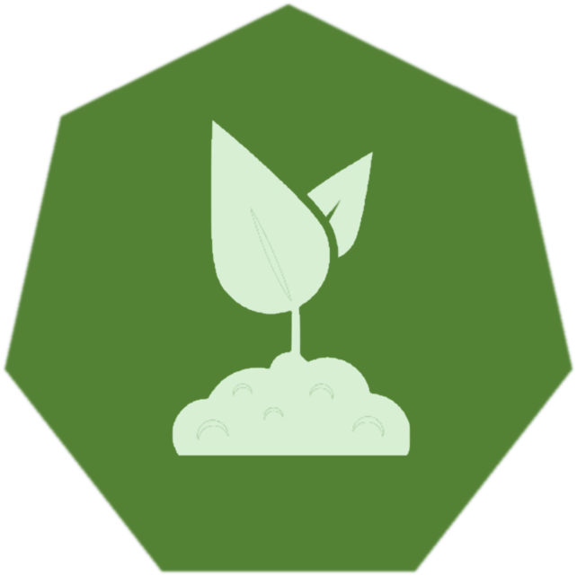

### Terraform Template to Setup a Kubernetes Cluster on OpenStack/AWS/Azure

This project contains a [terraform environment](doc/files.md) to setup a kubernetes
cluster in various IaaS environments. The following IaaS layers are supported yet:

- Openstack
- AWS
- Azure

Kubify supports cluster setup, recovery from an etcd backup file and
rolling of cluster nodes. A cluster update is possible as long as the contained
components can just be redeployed and the update is done by a rolling update by the
kubernetes controllers. The update of the kubelets is supported without rolling the
nodes.

The target cluster can be enriched by a set of predefinied [addons](doc/addons.md) that comes out of the box
with this template project.

For the technical launch of a cluster [bootkube](https://github.com/kubernetes-incubator/bootkube/blob/master/README.md) is used on CoreOS VMs.

The setup is completely handled by a single terraform project, which uses specific terraform modules
handling IaaS related tasks. Recovery is handled by a specific bootstrap etcd deployment
together with the regular bootkube mechanism.

Kubify is designed to be used as a git submodule for a cluster specific project that hosts a
specific cluster's configuration and the selection of a cluster variant (openstack/aws/azure).
Here also the terraform state is stored which enables performing cluster modifications later based
on the same terraform project.

#### Cluster Environment

##### Bastion and Node Access
Remote access to cluster nodes can be restricted by a bastion VM. Using a bastion allows omitting
public access to every cluster node. Node access will automatically use the bastion host.
It is also possible to assign public IP addresses to every node, in this case no bastion host is required.

##### Bootstrapping
All nodes are fully configured by a cloud-init file. Active parts are handled by systemd services.
The kubelet is run by using the kubelet wrapper mechanism provided by CoreOS. Therefore always CoreOS images
are used for the cluster nodes. The kubelet version is controlled by a dedicated file. In case this is
changed the kubelet service is automatically restarted. This can be used to implement version upgrades of
kubelets without requiring reinstallation of nodes.

The cluster is bootstrapped using [bootkube](https://github.com/kubernetes-incubator/bootkube/blob/master/README.md).
Bootstrapping is always done by the first (index 0) master node. Therefore a bootkube service
is configured on master nodes. It automatically starts when an appropriate configuration file is present.
The bootkube configuration is prepared by terraform and propagated to the first master node by a remote
provisioner. This is done exactly once. On subsequent calls to terraform an appropriate `auto` terraform
configuration file is generated which disables the bootstrap resource in order to avoid repeated
bootstrapping.

##### Recovery
Kubify supports cluster recovery from an etcd backup file. Recovery uses the terraform project
used to setup the cluster by enabling the recovery mode and executing `terraform apply`, again.
In recovery mode the master nodes and volumes are recreated and the cluster bootstrap is reinitiated
using the etcd backup in order to initialize the bootstrap etcd cluster. This is the only difference
compared to an initial cluster setup.

##### ETCD
The current setup uses a self hosted etcd approach supported by bootkube and the etcd operator.
The etcd is scaled with the master nodes and uses a persistent volume for their persistence.
For bootrapped clusters the etcd operator does not support kubernetes volumes, therefore a
VM volume for master nodes is created and used to back the host path used by the etcd cluster

##### API Server
The API Server can only run on master nodes. It uses the node port 443. This is used to create a load balancer
for this port and the set of master nodes.

##### Ingress
The same mechanism is used to statically provide a load balancer for the nginx ingress controller
for http(s) access. The nginx pods are running on the worker nodes, only.
Here the ports 80 and 443 are used as node ports on the worker nodes.

Basically nginx could also use a load balancer created by a service object, but then it would not be possible to
generate the DNS and load balancer environment in advance using terraform. This could be changed if either the
public IP assigned to the load balancer could be configured by the service object or if there would be a DNS
controller in Kubernetes.  But then the constraint for the IaaS layer is to offer (???) load balancers with dedicated
public IPs. This is, for example, not the case for AWS (???). Always using statically provided load balancers for
the ingress should works for all environments.

#### Rolling updates of nodes.
If the configuration of master or worker nodes require a recreation of VMs, this is done by upating
each node with a separate call to `terraform apply` one by one. With every successfull execution the update
of the next master/worker node is triggered. This is completely implemented by the terraform configuration files
and by keeping the actual state in a separate json file which can later again be read as a terraform variable file
(auto file). Configuration variables allow to configure the behaviour of node rolling.

#### Setup a new cluster

- Create a new git repository representing the desired new cluster
  This repository is used to keep track of the used terraform template version, the terraform configuration
  and state of the cluster.

  ```
  mkdir <cluster-name>
  cd <cluster-name>
  git init
  git remote add origin <git repository url>
  ```
- Prepare the cluster project content

  Add a `.gitignore` file

  ```
  .terraform/
  terraform/
  gen/
  tmp/
  .sw[opq]
  ```

- Add the kubify repository as a git submodule with the name `k8s`.

  ```
  git submodule add https://github.com/gardener/kubify.git k8s
  git submodule init
  ```

- Select the cluster IaaS variant to be used
  Create a symbolic link `variant` pointing to the variant to use. Variants are
  stored in folder `variants` inside the submodule residing in folder `k8s`.

  Currently three variants are supported
     - openstack
     - aws
     - azure

  For example:

  ```
  ln -s k8s/variants/openstack variant
  ```

  Starting from terraform 0.10.6 symbolic link handling does not work correctly anymore.
  Here you cannot use the direct variant link anymore. Instead run

  ```
  k8s/bin/prepare <variant name>
  ```

  to select the variant for your cluster project. If the variant has already been configured earlier, the
  argument can be omitted.
  This script generates a copy of the k8s module and replaces the indirect link `variants/current`
  by a direct link to the desired variant, instead of using the `variant` link in the
  cluster project. Whenever a new version of Kubify (this project) is used for the cluster project,
  this copy must be updated by calling `prepare` again.


- Add the configuration values for your cluster (`terraform.tfvars`)

  For openstack this could look like this:

  ```
  os_user_name="<your user>"
  os_password="<your password>"
  os_auth_url="<your keystone auth url>"
  os_tenant_name="<your tenant name>"
  os_domain_name="<your openstack domain name>"
  os_region="<your region>"
  os_fip_pool_name="<your fip pool name>"

  cluster_name="<your cluster name>"
  cluster_type="<your cluster type>"

  # DNS
  dns = {
    dns_type = "route53"
    access_key="<route53 access key>"
    secret_key="<route53 secret key>"
    hosted_zone_id="<route53 hosted zone id>"
    hosted_zone_domain="<domain>"
  }

  # cluster size
  master = {
    count=3
    flavor_name="medium_4_8"
  }

  worker = {
    count=3
    flavor_name="medium_2_4"
  }
  ```

- Setup the cluster
  Now you can call regular terraform commands for the project `variant`

  ```
  terraform init variant
  terraform plan variant
  terraform apply variant
  ```

#### Helper commands

- Terraform commands
  There are shortcuts available including the `get` step during development:

  ```
  k8s/bin/plan
  k8s/bin/apply
  k8s/bin/tf <terraform command>
  ```

  This command sequence automatically runs the prepare step and the terraform get step, if required.

- Access to master, worker and bastion nodes

  ```
  k8s/bin/master [<n> [<shell command to execute on master>]]
  k8s/bin/worker [<n> [<shell command to execute on worker>]]

  k8s/bin/master list   # list all IPs of VMs intended for master nodes
  k8s/bin/worker list   # list all IPs of VMs intended for worker nodes

  k8s/bin/bastion
  ```

- Access to the api server
  The config file for `kubectl` can be found in `gen/assets/auth/kubeconfig`.
  Or just call
  - `k8s/bin/k <options>`                    # for kubectl
  - `k8s/bin/ks <options>`                   # for kubectl -n kube-system
  - `k8s/bin/kurl <url path for rest call>   # for curl <api url>/<restcall>

#### Quick Setup

Alternatively you can copy the project templates prepared for your IaaS environment of choice:
  - for Openstack: https://github.com/gardener/kubify-openstack-template.git
  - for AWS: https://github.com/gardener/kubify-aws-template.git

Afterwards you should set the `origin` to your upstream git repository.
It is strongly recommended to maintain such a *cluster* project keeping track
of the actual state of your cluster.

---

Please remember: you should use
a *PRIVATE* repository, because it contains secrets and access keys
for the cluster AND the selected IaaS environment.

---

Then continue with the configuration steps above.

It uses the same submodule, so don't forget to call

```
git submodule update --init --recursive
```

#### Configuration Settings

First of all there are required settings for every IaaS environment:
  - [Openstack](doc/openstack.md)
  - [AWS](doc/aws.md)
  - [Azure](doc/azure.md)

In addition there are various general settings that are independent of the chosen platform variant.
Most of them have defaults that typically don't need to be changed.

The folloing variables are required for every cluster:

|Name|Meaning|
|--|--|
|cluster_name|Name of the cluster. Used for DNS entries, the kubernetes cluster and for labelling the IaaS elements|
|cluster_type|Type key of the cluster (for example: `seed` or `infra`). It ts used for the DNS entries and labeling the IaaS elements|
|dashboard_creds|The credential file the kubernetes dashboard created by `htpasswd`. Unfortunately terraform does not support `bcrypt` up to now|
|master|Settings for master nodes (see below)|
|worker|Settimgs for worker nodes (see below)|
|bastion|Settimgs for bastion VM (see below)|

`master` and `worker` use the following common structure

|Name|Meaning|
|--|--|
|count|Number of nodes (for master this should be an odd number, because it is also used to scale the cluster etcd service|
|flavor_name|Optional: flavor used for the VM|
|image_name|Optional: image used for the VM|
|assign_fips|Optional: Always assign public IP to nodes|
|root_volume_size|Optional: Size in GB of root volume (default: 50)|
|volume_size|Optional: Size in GB of persistent volume for master (default: 20), should not be used for worker|
|update_mode|Optional: Update mode for VMs|
|generation|Optional: explicit node generation count to enforce recreation|

For the `bastion` settings the following structure is used

|Name|Meaning|
|--|--|
|flavor_name|Optional: flavor used for the VM|
|image_name|Optional: image used for the VM|
|user_name|Optional: user name of initial admin user of image|

DNS configuration is done via the input map `dns`. It contains an entry `dns_type` to select the desired DNS
provider and additional configuration entries required for that provider.

So far only `route53` is supported as DNS provider. Therefore dedicated AWS credentials
 with appropriate permissions are required.

Configuration of the `route53` DNS provider:

|Name|Meaning|
|--|--|
|access_key|AWS access key for route53 access|
|secret_key|AWS secret key for route53 access|
|hosted_zone_id|Id of AWS hosted zone to use for the DNS entries|
|hosted_zone_domain|Optional: domain name of hosted zone. Required if no `base_domain` or `domain_name` is configured for cluster. It is used to generate a unique domain name for clusters generated with kubify in this domain.|

Etcd can be configured to create backups using the etcd operator. This can also be
configured with the terraform project using the input map variable `etcd_backup`.
The folowing backup modes are supported:
- `s3`: AWS S3
- `pv`: Persistent volume in cluster
The default is `pv`. An appropriate kubernetes storage class is always created
by the platform specific parts.

The mode is configured with the map entry `storage_type`. Other entries are used to
configure the selected storage type.

For `s3` AWS credentials must be configured:

|Name|Meaning|
|--|--|
|access_key|AWS access key for S3 access|
|secret_key|AWS secret key for S3 access|

Besides those mandatory settings there are various optional settings.

##### Addons

Several [addons](doc/addons.md) can be chosen for optional deployment.

##### General settings

|Name|Meaning|
|--|--|
|ca_cert_pem|Root certificate to be used for the cluster. By default generated for the dedicated cluster|
|ca_key_pem|Key for the root certificate. Must always be configured together with `ca_cert_pem`|
|base_domain|Base domain used for the cluster instead of generating it. The cluster name is still prepended|
|domain_name|Domain name of the cluster. Sub domains are created for api, ingress,....|
|additional_domains|List of additional domain names used for certificate generation|

##### Node settings

These are otional settings for all kinds of nodes

|Name|Meaning|
|--|--|
|root_certs_file|File containing additional root certificates to be installed on the nodes|
|dns_nameservers|List of DNS servers to configure for the subnets and/or VMs|
|flavor_name|Default flavor for all kinds of VMs|
|subnet_cidr|IP range for node subnet (defaulted by IaaS modules)|

It is possible to specify IaaS specific names (or search pattern for AWS). Additionally 
some mappings for preconfigured names come out of the box with this project:

- ubuntu-16.04
- coreos-1520.6.0 (not on Azure)
- coreos-1548.3.0 (Azure)

Actual settings can be found [here](modules/vms/versions.tf).
With every new release more preconfigured settings are delivered with Kubify.

|Name|Meaning|
|--|--|
|use_bastion|Use bastion host to avoid public node IPs if possible (depends on IAAS environment)|
|use_lbaas|For testing purposes switch off load balancers|
|configure_additional_dns|Create DNS entries for `additional_domains`|

##### Kubernetes Configuration

|Name|Meaning|
|--|--|
|oidc_issuer_domain|OIDC configuration for API server|
|oidc_issuer_subdomain|OIDC configuration for API server|
|oidc_client_id|OIDC configuration for API server, default: `kube-kubectl`|
|oidc_username_claim|OIDC configuration for API server, default: `email`|
|oidc_groups_claim|OIDC configuration for API server, default: `groups`|
|service_cidr|Kubenetes cluster ip range (services) (default: 10.241.0.0/17)|
|pod_cidr|Kubenetes pod ip range (default: 10.241.128.0/17)|

##### VM update

|Name|Meaning|
|--|--|
|node_update_mode|Standard node update mode (`Roll`, `All` or `None`)|
|update_kubelet|handle kubelet update (default: false)|

Additional node kind specific settings can be set using the `master` and  `worker` configuration
variables.

##### Recovery

|Name|Meaning|
|--|--|
|recover_cluster|Enable cluster [recovery mode](#cluster-recovery) if set to `true|
|etcd_backup_file|Local path to the etcd backup file|

##### Component versions

Versions are coming with the releases of this project. It is possible to override various versions, but
there is no guarantee a selected combination of component versions works flawlessly (and with this terraform script)
Actual versions are defined [here](modules/versions/defaults.tf).

Versions can be configured as member of a map variable `versions`. The following keys are supported:

|Name|Meaning|
|--|--|
|image_name|image used for cluster VMs (master and nodes)|
|bastion_image_name|image used for bastion VMs|
|kubernetes_version|kubernetes version|
|dns_version|DNS version|
|flannel_version|flannel version|
|cni_version|CNI version|
|etcd_version|etcd version|
|etcd_operator_version|etcd operator version|
|bootkube|bootkube image name (default: `quay.io/coreos/bootkube`)|
|bootkube_version|bootkube version|
|kubernetes_hyperkube|image base name (default: `gcr.io/google_containers/hyperkube`)|
|kubernetes_hyperkube_patch|image name suffix (default: `_coreos.0`)|
|nginx_version|nginx version|
|lego_version|lego version|

#### Cluster Recovery

Store your etcd backup file somewhere in the filesystem and add the following settings to your
`terraform.tfvars` file.

```
recover_cluster = "true"
etcd_backup_file= "<your etcd.backup file path>"
```

Now just re-run `terraform apply variant` (or try `plan` first).

This recreates the master volumes and nodes and then recreates the cluster using the backup as initial
etcd content. All manual changes to your deployment of the standard components will be lost,
because all standard components (not only the control plane) will be updated to the version
configured in the terraform project.

#### Migrating to new Versions of the Kubify Project

Every new version of this project comes with a migration script
[`migration.mig`](migrate.mig)  that is used by the command
`migrate`. It is used to adapt terraform state files generated
by former versions of this project before they can be
used with the actual version. With this mechanism it is possible
to change the structure of the terraform project for new
versions without loosing cluster projects based on older
versions. Nevertheless there might still be changes that
cannot be migrated. The migration script then prompts
an information about the latest commit, that can be used
with the actual state version.

For this purpose the state structure used by this project is
versioned (in `modules/instance/version.tf`). Running the 
project generates a file `structure_version` containing
the actual version. Additionally the version is also
contained in the `state.auto.tfvars` file.

The migration
of the actual state file to the lastest structure version is done
version by version until the actual version is reached.

The utility command `apply`, `plan` and `tf` implicitly
do the state migration if required. If terraform is called
manually the migration steps have be explicitly done by
using the `migrate` utility command. It can always be called,
because it checks if an action is required before touching
the state file. 

The migration command provides some utility functions
used by the migration script. After defining those functions
it just calls the migration script as regular shell script.
The utility functions are based on the state manipulation
sub commands of the `terraform` command.
